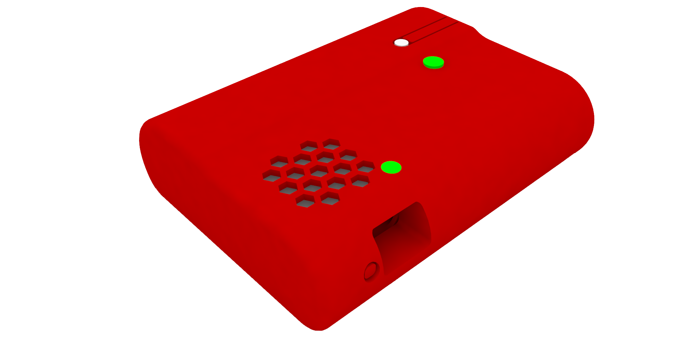

# GORGAS tracker - Project: Malaria and Human Mobility in the Peruvian Amazon

The GORGAS tracker is an open-source GPS tracker developed by the [Health Innovation Lab](https://imtavh.cayetano.edu.pe/en/research/labs/health-innovation-laboratory.html) from The Institute of Tropical Medicine "Alexander von Humboldt". The GPS tracker was developed and used in a cohort study to investigate the role of human population movement in malaria epidemiology in rural villages in the Peruvian Amazon river networks.

The GORGAS tracker is based on the [Rephone](http://wiki.seeedstudio.com/RePhone/) platform (SeeedStudio) and has the following characteristics:
* Long-life battery
* Stores GPS coordinates and timestamp
* Sets a buffer area and report if a participant move outside that boundary
* Locks the interaction with the participant
* Easy set-up during fieldwork using a laptop/tablet (visual interface)

Are you ready to build your own GORGAS tracker?
* : Bill of materials and STL files
* : GORGAS tracker algorithms
* : PC/Tablet Visual Interface

***Understanding the relationship between malaria transmission and human mobility in diverse endemic settings is key for designing and implementing locally adapted and sustainable control and elimination strategies*** (Rosa-Aguirre et al., 2017).
